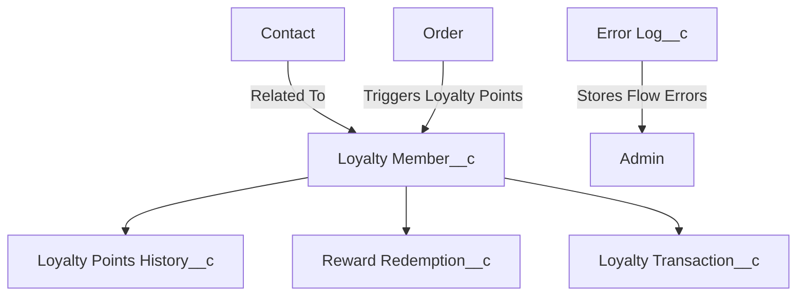

# 🛒 **MyEcommerce Customer-360 Loyalty — Salesforce Project**

<p align="center">
  
  
  
  
</p>

---

## 📖 **Table of Contents**
- [Overview](#-overview)
- [Tech Stack](#-tech-stack)
- [Project Architecture](#-project-architecture)
- [Features by Phase](#-features-by-phase)
- [Setup Instructions](#️-setup-instructions)
- [Usage Guide](#-usage-guide)
- [Reports & Dashboards](#-reports--dashboards)
- [Testing](#-testing)
- [Screenshots](#-screenshots)
- [Future Roadmap](#-future-roadmap)
- [Contributors](#-contributors)

---

## 📌 **Overview**
The **MyEcommerce Customer-360 Salesforce Project** is a full-stack Salesforce CRM implementation that simulates an **E-Commerce Loyalty Program**.

It showcases both **Admin & Developer** capabilities including:
✅ Custom Object Modeling  
✅ Flows & Record-Triggered Automation  
✅ Approval Processes for Sensitive Actions  
✅ Validation Rules for Data Integrity  
✅ Apex Triggers & Classes for Business Logic  
✅ Reports & Dashboards for Insights  
✅ Deployment & Version Control using **VS Code + GitHub**

---

## 🛠 **Tech Stack**
| Category | Tools / Components |
|-----------|--------------------|
| **Platform** | Salesforce (Enterprise Edition) |
| **Backend Logic** | Apex Triggers, Classes, Test Cases |
| **Automation** | Salesforce Flows |
| **Data Validation** | Validation Rules |
| **Processes** | Approval Processes |
| **Analytics** | Reports & Dashboards |
| **CLI & Deployment** | Salesforce CLI (sfdx / sf) |
| **Development** | Visual Studio Code |
| **Version Control** | GitHub Repository |

---

## 🏗 **Project Architecture**


---

## 🚀 **Features by Phase**
### 🧩 **Phase 1: Data Model**
- Custom Objects: `Loyalty_Member__c`, `Reward_Redemption__c`, `Loyalty_Points_History__c`, `Loyalty_Transaction__c`, `Error_Log__c`
- Fields: Loyalty Points Balance, Tier, Reward Name, Amount, etc.

### ⚙️ **Phase 2: Flows & Automation**
- Order Activation Flow → Adds loyalty points  
- Reward Claim Portal Flow → Redeems points  
- Inactive Customer Flow → Sends re-engagement emails  
- Sync Tier Flow → Updates Contact record  
- Error Logging Flow → Tracks automation failures  

### 🔒 **Phase 3: Validation Rules**
- Prevent negative loyalty points  
- Tier required if points exist  
- Redemption amount > 0  

### 🧾 **Phase 4: Approval Processes**
- Contact → Manager Approval  
- High-Value Reward → Approval Required  

### 🧠 **Phase 5: Apex Development**
- `OrderTriggerHandler.cls` → Loyalty point calculations  
- `OrderTrigger.trigger` → Fires when orders activate  
- `OrderTriggerHandlerTest.cls` → Unit tests (≥75% coverage pending)  

### 👥 **Phase 6: Profiles & Permission Sets**
- Support Agent / Support Manager Profiles  
- Permission Sets: Case Team Lead Access, Experience Profile Manager  

### 💼 **Phase 7: Support Agent Console**
- Lightning Console Workspace  
- Tabs: Cases, Orders, Loyalty Members  
- Related Lists + Record Details  

### 📊 **Phase 8: Reports & Dashboards**
- Reports: Inactive Customers, Reward Redemptions, Loyalty Points by Member, Orders Driving Points  
- Dashboard: Loyalty Program Dashboard  

### 💻 **Phase 9: Deployment & GitHub**
- Retrieved Metadata using Salesforce CLI  
- Stored under `/force-app/main/default/`  

### 🧪 **Phase 10: Testing & Validation**
- Flows debugged  
- Approval processes verified  
- Apex tests validated  

---

## ⚙️ **Setup Instructions**
```bash
# 1️⃣ Clone Repository
git clone <your-repo-url>
cd MyEcommerceProject

# 2️⃣ Authenticate Salesforce Org
sf org login web --alias mySandbox --set-default

# 3️⃣ Deploy Metadata
sf project deploy start --target-org mySandbox

# 4️⃣ Assign Profiles & Permissions
Support Agent Profile → Agents  
Support Manager Profile → Managers

# 5️⃣ Activate Required Flows
Setup → Flows → Activate
```

---

## 📘 **Usage Guide**
1. Create an Order → Loyalty Points are automatically added.  
2. Claim Rewards → Use Reward Claim Flow if eligible.  
3. Inactive Customer Flow → Sends reminder emails.  
4. Manager Approvals → Approve or Reject high-value redemptions.  

---

## 📊 **Reports & Dashboards**
📁 **Reports Folder:** `Public Reports`  
📁 **Dashboard Folder:** `Private Dashboards`  

**Key Reports:**
- Loyalty Points by Member  
- Orders Driving Points  
- Reward Redemptions by Status  

**Main Dashboard:**  
📈 *Loyalty Program Dashboard* — Visualizes customer engagement and reward trends.

---

## 🧪 **Testing**
Run Apex Test Classes:
```bash
# From Salesforce Developer Console
OrderTriggerHandlerTest
```
Debug Flows:
- Use Flow Builder → Debug Mode  
- Check `Error_Log__c` records for automation failures  

---

## 🖼 **Screenshots**
<p align="center">
  
  <br/><em>📊 Loyalty Program Dashboard</em>
</p>

<p align="center">
  
  <br/><em>🎯 Salesforce Agent Console</em>
</p>

---

## 🔮 **Future Roadmap**
✅ Add unit test coverage > 90%  
✅ Add CI/CD Pipeline using GitHub Actions  
✅ Add Drill-Down Reports in Dashboards  
✅ Enable Multi-Level Reward Approvals  
✅ Integrate with Experience Cloud Portal  

---

## 👨‍💻 **Contributors**
| Name | Role | Contributions |
|------|------|----------------|
| **Ganesh** | Lead Developer & Salesforce Admin | Built & tested all project phases. Configured flows, approvals, dashboards, triggers, and deployment pipelines. |

---

### ⭐ **If you like this project, consider giving it a star on GitHub!**
<p align="center">
  
</p>
